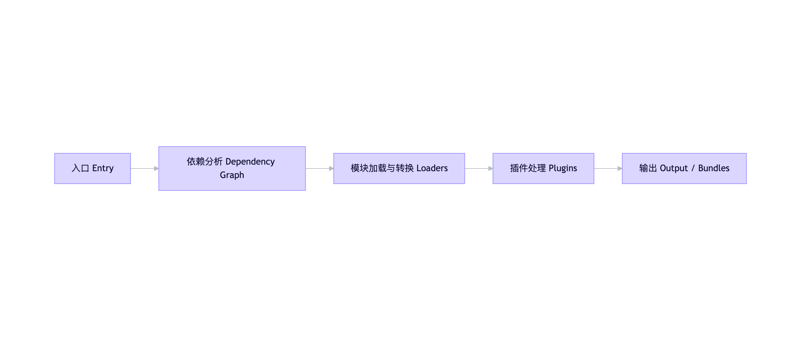

# 定位

**模块化构建系统** - webpack本质上是一个静态模块打包器，它将前端项目中的所有资源都视为模块，通过依赖关系构建成一个依赖图，最终输出优化后的静态资源。

**入口（Entry）**：入口文件，构建依赖图的根节点，配置多入口还可以实现代码分隔和按需加载的关键基础。

**出口（Output）**：配置一些输出策略，比如目录、构建产物的组织方式、性能有害、部署策略等等。

**加载器（Loaders）**：webpack默认只支持js和json文件，其他类型的文件无法支持，所以需要配置相应的loader进行文件内容的解析转换，loader本质是函数式转换通道，将源文件内容转换为可被webpack处理的模块。

**插件（Plugins）**：主要作用是通过Tapable事件系统在webpack构建的各个生命周期中插入自定义逻辑。

# 打包过程

1. 确定入口
2. 递归解析依赖
3. 模块转化，用Loaders处理非JS资源
4. 优化与增强，用plugins注入自定义逻辑
5. 生成输出

### 阶段一：初始化配置 & 编译器创建
读取配置文件，合并默认配置和用户配置，创建Compiler实例。

### 阶段二：从入口开始，构建依赖图
读取入口文件、使用解析器解析AST抽象语法书，遍历所有AST，找出所有import/require语句。

递归加载每个依赖模块，构建完整的模块依赖图。

### 阶段三：Loaders处理模块转换
webpack原生之理解JS和JSON，loaders按rules匹配文件后缀或路径

对匹配的模块链式调用loaders，最终转为js模块

**常见的loader**：

- 转译类	转换语法	babel-loader（ES6+ → ES5）
- 样式类	处理 CSS/SCSS	css-loader, sass-loader
- 文件类	处理图片/字体	url-loader, file-loader（Webpack 5 用 Asset Modules 替代）
- 模板类	处理 HTML	html-loader

### 阶段四：插件处理 Plugins

本质上是一个带有apply(compiler)方法的类，解决loader解决不了的事，做全局的操作，比如压缩代码，提取css、清理dist目录，生成html文件。

- 基于webpack的事件钩子系统
- 在构建生命周期的特定时机注入自定义逻辑

**核心plugin示例**：

- HtmlWebpackPlugin	自动生成 index.html 并注入 bundle	emit 阶段
- MiniCssExtractPlugin	将 CSS 提取为独立文件（替代 style-loader）	module/chunk 生成时
- TerserPlugin	压缩 JS 代码	optimize-chunk-assets
- CleanWebpackPlugin	清理 output 目录	compile 开始前